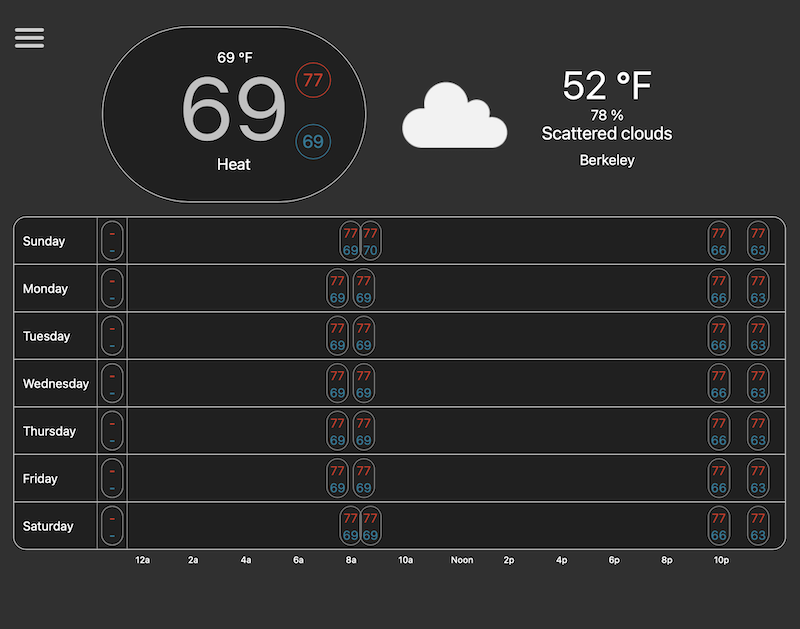
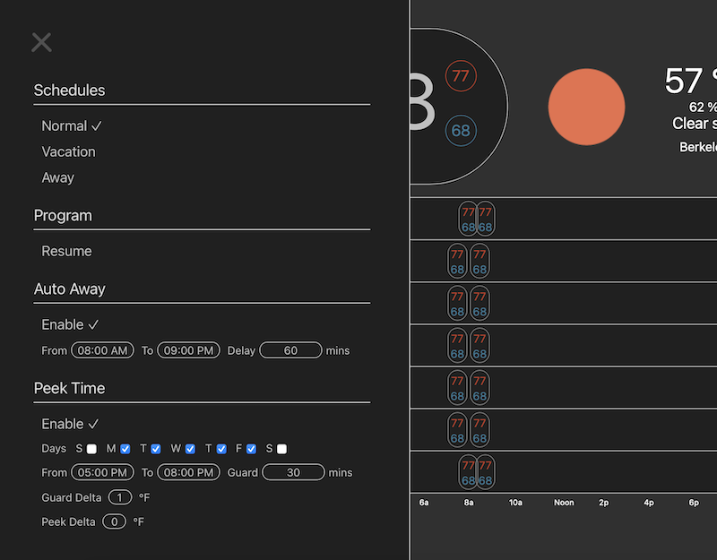

# homebridge-fujitsu-smart
## Homebridge plug in for Fujistu Mini Split with smart temperature support using Xiaomi sensors.

This started life as an extension to the current mini-split module but with fan control, and rapidly got out of hand ...

**Warning** this plugin this is currently experimental, use at your own risk! It will probably burn your house down.




## Installation

1. Install [homebridge](https://github.com/nfarina/homebridge#installation-details)
2. Install this plugin: `npm install -g homebridge-fujitsu-smart`
3. Edit your `config.json` file (See below).

```json
"accessories": [
    {
        "accessory": "FGLairSmartThermostat",
        "name": "Fujitsu Mini Spit",
        "username": "FGLAIR USERNAME",
        "password": "FGLAIR PASSWORD",
        "interval": 30,
        "smart": {
            "miio": {
                "username": "MII USERNAME",
                "password": "MII PASSWORD",
                "region": "cn"
            },
            "reference": "THERMOSTAT ROOM",
            "feelslike": true,
            "hold": 60,
            "unit": "f",
            "schedule": [{
                "day": "Any",
                "time": "12:00am",
                "low": 67,
                "high": 75,
                "rooms": {
                    "THERMOSTAT ROOM":  { "occupied":  50, "empty":  0 },
                    "Kitchen":          { "occupied": 100, "empty":  0 }
                }
            }],
            "portnr": 8080,
            "weather": {
                "key": "OPENWEATHERMAPAPI KEY",
                "zipcode": "94707"
            }
        }
    },
]
```
| Key | Description |
| --- | --- |
| `accessory` | Must be `FGLairSmartThermostat` |
| `name` | Name to appear in the Home app |
| `username` | `FGLair` Username |
| `password` | `FGLair` Password |
| `model` _(optional)_ | Appears under "Model" for your accessory in the Home app |
| `interval` _(optional)_ | Polling time for thermostat (Default: 60 sec.) |
| `region` _(optional)_ | Region for thermostat, change for China & E.U. (Default: "us") |
| `smart` _(optional)_ | Sensor configuration to allow smart adaption of thermostat temperature. |
| `smart.miio.username` | `Mi Home` Username |
| `smart.miio.password` | `Mi Home` Password |
| `smart.miio.region` _(optional)_ | Will default to `cn` which supports the latest range of sensor types, but can be set to other regions |
| `smart.reference` | The room name of a sensor which is used as the temperature reference when making thermostat adjustments. This should be the sensor nearest the thermostat (the thermostat API doesn't provide its own temperature reading) |
| `smart.feeslike` _(optional)_ | If `true` the temperatures will be adjusted based on the humidity, to better refect the temperatures rooms feel |
| `smart.hold` _(optional)_ | Number of minutes (Default: 60 mins.) to hold the temperature without adjustment if changed externally (e.g. on the wall thermostat)
| `smart.unit` _(optional)_ | The units (C or F) for the low and high temperatures in the schedule (Default: C) |
| `smart.schedule` _(optional)_ | If present, zero or more schedule entries describing how to control the HVAC and when room sensors are important. If not present, a web UI is started to allow visual configuration |
| `smart.schedule.day` | A day `(Sun,Mon,Tue,Wed,Thu,Fri,Sat)` or a series of days `(Mon-Thu)` or `Any` specifying which day this schedule applies |
| `smart.schedule.time` | A time `(e.g 1:00pm,12:13am,11:59pm)` when this schedule starts. It will remain active until the next schedule entry |
| `smart.schedule.low` | The lowest the temperature should be allowed to go (in `unit`s) |
| `smart.schedule.high` | The highest the temperature should be allowed to go (in `unit`s)  |
| `smart.schedule.trigger` _(optional_) | An array of triggers, one of which must occur before this schedule is valid |
| `smart.schedule.trigger.type` _(optional)_ | The trigger type (Default: motion)
| `smart.schedule.trigger.room` | The room containing the motion trigger |
| `smart.schedule.fan` _(optional)_ | Whether to always run the fan or just as needed (Default: 'Auto') |
| `smart.schedule.rooms` | An object of rooms, where the key is the room name. The room name should match the beginning name of the sensor `(e.g. Dining Room` has sensors `Dining Room Temperature` and `Dining Room Movement)` |
| `smart.schedule.rooms.ROOM.occupied` | A weight from `0-100` specifying how important this schedule is, higher being more important. This weight is for when the room is occupied (or always if the room has no motion sensor) |
| `smart.schedule.rooms.ROOM.empty` _(optional)_ | A weight for when the room has been empty for 30 minutes or more |
| `smart.away` _(optional)_ | Enable auto-away schedule. If no movement is detected then the away schedule can be automatically started |
| `smart.away.from` _(optional)_ | Start time for when auto-away can be activated (Default: 6am) |
| `smart.away.to` _(optional)_ | End time for when auto-away can be activated (Default: 9pm) |
| `smart.away.wait` _(optional)_ | How long since movement was detected before the away schedule is activated (Default: 60 minutes) |
| `smart.portnr` _(optional)_ | Port number for Web UI (Default: 8080) |
| `smart.weather` _(optional)_ | If provided, allows the Web UI to display the current weather. Weather information is read from the OpenWeatherMap API. Provide one of `city`, `latLong`, `cityId` or `zipcode` |
| `smart.weather.key` | OpenWeatherMap API key |
| `smart.weather.lang` _(optional)_ | Language for weather information (Default: en) |
| `smart.weather.city` _(optional)_ | City name for weather |
| `smart.weather.latLong` _(optional)_ | `[Longitude,Latitude]` for weather |
| `smart.weather.cityId` _(optional)_ | OpenWeatherMap city id for weather |
| `smart.weather.zipcode` _(optional)_ | Zipcode for weather |

## Smart operation
Smart operation uses Xiomi temperature, humidity and movement sensors to adjust the thermostat target temperature depending on where you are in your house (in a similar way to the Ecobee thermostat) and the schedule defined. Smart operation takes over the scheduling from your home thermostat and you should disable it.

Sensors must be registered using the `Mi Home` application.

This plugin will read the sensors periodically, then caclulate a weighted temperature based on the defined schedule, and adjust the thermostat based on this. If the wall temperature is changed by hand, this will override the schedule for a set period of time before the schedule resumes.

## Current limitations
- Only one air conditioner is displayed, the API chooses the first device.  I only have one system, so feel free to contribute changes if you have more than one A/C unit.
- Timeout on token is not enabled, when token is invalid the API will re-authenticate.
- Auth. Token is not cached
- Previous thermostat state is not cached
- For US users, Aqara devices seem like the obvious sensor choice. If anyone knows how to easily read these (no ferreting around for tokens in encypted backups) please let me know as I've had no luck :-(

## Wouldn't it be nice ...
- If HomeKit devices could be allowed read other HomeKit devices state (e.g. sensors). I realize there are security concerns here, but still ...

## TODO
- **Lots and lots of testing. Seriously this could burn your house down at the moment.**

## Contributions
Portions of this software adapted from the projects listed below.  A huge thank you, for all their work.

- The original homebridge-fujitsu plugin https://github.com/smithersDBQ/homebridge-fujitsu

- The pyfujitsu project under Apache License
Copyright (c) 2018 Mmodarre https://github.com/Mmodarre/pyfujitsu

- The homebridge-dummy-thermostat under the Unlicense
https://github.com/X1ZOR/homebridge-dummy-thermostat

- The node-mihome library https://github.com/maxinminax/node-mihome
